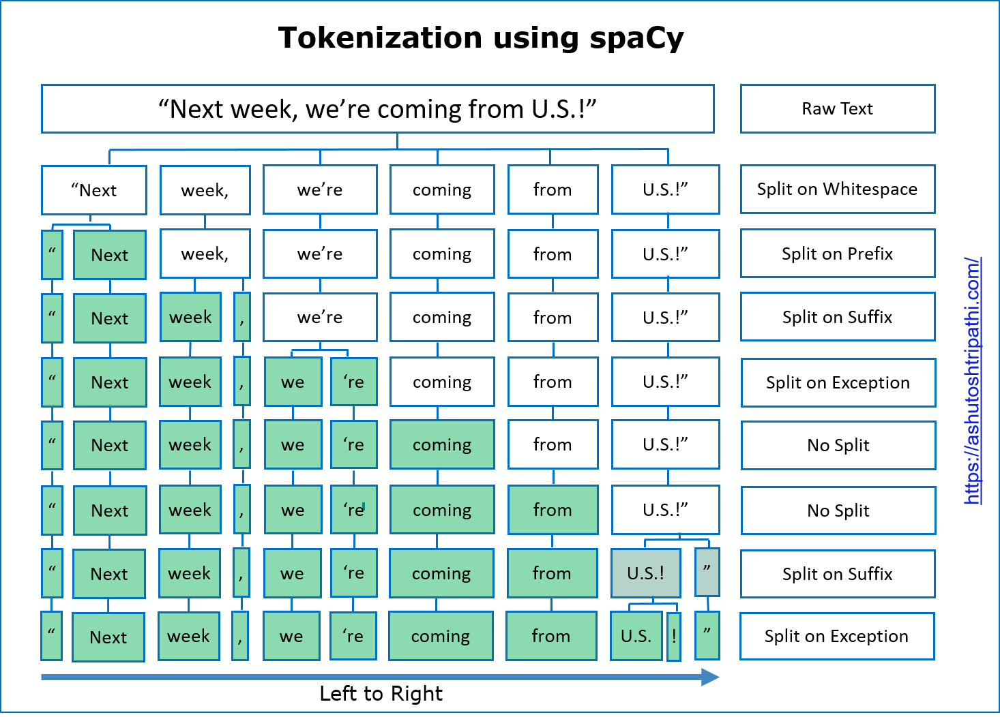
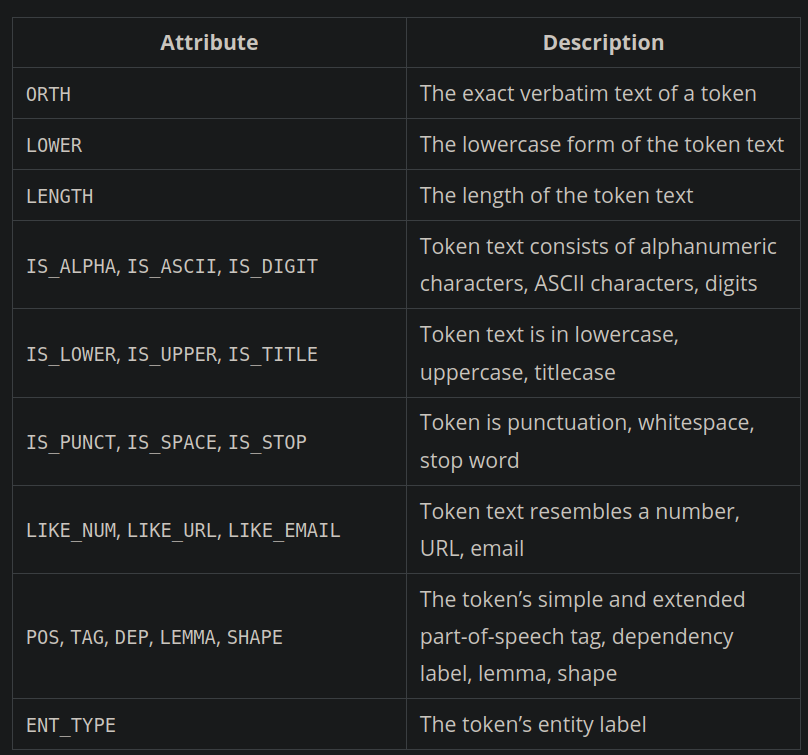

# Tokenization

Split the text in to tokens.



```Python
# customizing tokenization in spacy 3.0
import spacy
from spacy.symbols import ORTH

nlp = spacy.load("en_core_web_md")

doc = nlp("gimme that")  # phrase to tokenize

# get the models vocabulary
print(len(doc.vocab))

print([w.text for w in doc])  # ['gimme', 'that']

# Add special case rule
special_case = [{ORTH: "gim"}, {ORTH: "me"}]
nlp.tokenizer.add_special_case("gimme", special_case)

# Check new tokenization
print([w.text for w in nlp("gimme that")])  # ['gim', 'me', 'that']
```

Detailed explanation on the tokenization can be found in [this tutorial](https://ashutoshtripathi.com/2020/04/06/guide-to-tokenization-lemmatization-stop-words-and-phrase-matching-using-spacy/)

## Span

- Continuous tokens from the doc forms a span

```Python
doc = nlp("gimme that")  # phrase to tokenize

# since doc is an iterable, we can slice the doc
# we get the tokens spanning index 4 and 5
doc_span = doc[4:6]

print(type(doc_span)) # spacy.tokens.span.Span
```

## Matcher

- `Matcher` to match tokens in the `Doc` against predefined patterns.

```Python
from spacy.matcher import Matcher

# matcher needs the vocabulary of the NLP model
matcher = Matcher(nlp.vocab)

# define list of token structures we are expecting
pattern1 = [{"LOWER": "unitedstates" }]
# to match `united states`
pattern2 = [{"LOWER": "united"}, {"LOWER" : "states"}]
# to match `united-states` or `united--states`
pattern3 = [{"LOWER": "united"}, {"IS_PUNCT": True, "OP": "*"}, {"LOWER" : "states"}]


matcher.add("UnitedStates", [pattern1, pattern2, pattern3], on_match=None)

doc = nlp("The United States of America is a country consisting of 50 independent states.The first constitution of the UnitedStates was adopted in 1788. The current United-States flag was designed by a high school student – Robert G. Heft.")

matches = matcher(doc)

for match in matches:
    match_id, start, end = match
    string_id = nlp.vocab.strings[match_id]
    span = doc[start:end]
    print(match_id, string_id, span.text)
```

- Pattern quantifiers are exactly the same as regex`!`(negate), `?`(0 or 1), `+`(atleast 1), `*`(0 or more)

- To match against a word's lemma, use `{"LEMMA": "lemmatized_word"}` instead of `{"LOWER":"exact_word"}`



**NOTE**: You can pass an empty dictionary `{}` as a wildcard to represent any token. `[{'ORTH': '#'}, {}]` matches any token following `#`

`PhraseMatcher` is used to match against a list of phrases. Refer [NER](../pipeline/6_name_entity_recognition.md) on using `PhraseMatcher`

---

## References

- [Spacy tokenization](https://ashutoshtripathi.com/2020/04/06/guide-to-tokenization-lemmatization-stop-words-and-phrase-matching-using-spacy/)
