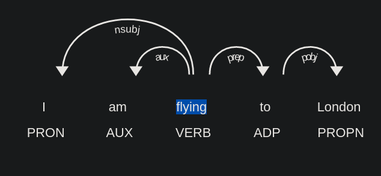

# Setting up Spacy

- `pip install spacy`

- `python -m spacy info` returns information like spacy version.

## Spacy statistical models

- `lang_type_genre_size` - is how the spacy statistical models are named.

- lang - Language
- type - type represenst the model's capabilities. **core** - general purpose model
- genre - Type of the text on which the model was trained. **web** - using resources from the internet.
- size - Size of the model. `sm` - small, `md` - medium, `lg` - large

- `python -m spacy download <model_name>` can be used to download the required statistical model.
- `python -m spacy download en` by default downloads `en_core_web_sm` model.

Models download documentation can be found [here](https://spacy.io/models/en)

## Processing pipeline


### Tokenization

Split the text in to tokens.

```Python
# customizing tokenization in spacy 3.0
import spacy
from spacy.symbols import ORTH

nlp = spacy.load("en_core_web_md")

doc = nlp("gimme that")  # phrase to tokenize

# get the models vocabulary
print(len(doc.vocab))

print([w.text for w in doc])  # ['gimme', 'that']

# Add special case rule
special_case = [{ORTH: "gim"}, {ORTH: "me"}]
nlp.tokenizer.add_special_case("gimme", special_case)

# Check new tokenization
print([w.text for w in nlp("gimme that")])  # ['gim', 'me', 'that']
```

Detailed explanation on the tokenization can be found in [this tutorial](https://ashutoshtripathi.com/2020/04/06/guide-to-tokenization-lemmatization-stop-words-and-phrase-matching-using-spacy/)

### Lemmatization

Returns the base form of a word(Ex: particle to base verb `flying` to `fly`).

We can also add custom entries to the tokenizer for returning lemmas related to a domain specific word.

For instance, `bombay` should return its lemma as `mumbai`. The below snippet adds custom entries to the tokenizer.

```Python
# Changed in version 3.0
# Book uses spacy v2.0
import spacy
from spacy.symbols import LEMMA

nlp = spacy.load("en_core_web_md")

custom_lemma = [
    [{"TEXT": "Bombay"}]
]

nlp.get_pipe("attribute_ruler").add(custom_lemma, {LEMMA: "Mumbai"})

for token in nlp("I am flying to Bombay"):
    print(f"{token.text}, {token.lemma_}")
```

**NOTE**: All the stages in the pipeline can be obtained using `nlp.pipe_names`. `nlp.pipeline` returns list of stage names and object. `nlp.get_pipe(stage_name)` can be used to get the object corresponding to the stage.

```Python
# get all the stages
nlp.pipe_names

# get the object
nlp.get_pipe("lemmatizer")
```

Counting the frequency of POS tags in a document

```Python
from spacy.attrs import POS, TAG

doc = nlp("I am flying to London")
# This returns count of coarse grained tag.
POS_counts = doc.count_by(POS)

# This returns count of fine grained tag.
# POS_counts = doc.count_by(TAG)

for k,v in POS_counts.items():
    print(f"attribute id: {k}, attribute text: {doc.vocab[k].text}, attr frequency: {v}")
```

### Part of speech tagging

[Coarse parts of speech tags](https://ashutoshtripathi.com/2020/04/13/parts-of-speech-tagging-and-dependency-parsing-using-spacy-nlp/)include

- Noun (NOUN)
- Propernoun (PROPN)
- Pronoun (PRON)
- Determiner (DET)
- Adjective (ADJ)
- Verb (VERB)
- Adverb (ADV)
- Auxiliary (AUX). Ex: `is`, `will`
- Preposition (adp)
- Punctuation (PUNCT)
- Particle (PART)
- Conjunction (CONJ)
- Coordinating conjunction (CCONJ)
- Subordinating conjunction (SCONJ)
- Interjection (INTJ)
- Symbol (SYM)
- Number (NUM)
- Other (X)
- Space (SPACE)

Coarse parts of speech tags are available through `Token.pos_`, while fine grained parts of speech tags are available through the property `Token.tag_`

[Fine grained parts of speech tags](https://ashutoshtripathi.com/2020/04/13/parts-of-speech-tagging-and-dependency-parsing-using-spacy-nlp/) include

To view description of either fine grained or coarse grained tag, use `spacy.explain(Token.tag_)`

```Python
for token in nlp("I am flying to Bombay"):
    print(f"{token.text}, {token.lemma_}, {token.tag_}, {spacy.explain(token.tag_)}")
```

### Syntactic Dependency parsing

- Process of extracting the dependencies of a sentence to represent its grammatical structure.

> The verb is usually the head of the sentence(ROOT). All other words are linked to the headword.

```Python
doc = nlp("I am flying to London")

for token in doc:
    print(f"{token.text}, {token.dep_}, {spacy.explain(token.dep_)}")
```

- Dependency parsing represents the words in the document as a directed graph.
- Word becomes the node and the edges provides the relationship between the nodes.

Visualizing dependency parsing

```Python
from spacy import displacy

doc = nlp("I am flying to London")

displacy.serve(doc, style="dep", options={"distance": 90})
```



### Sentence segmentation (Span)

The sentence split is referred to as spans.

```Python
doc = nlp("I am flying to London. I will be flying back to Frisco tomorrow.")

for sentence in doc.sents:
    print(sentence)
```

### Name Entity Recognition

- Available via `Token.ent_type` (int) or `Token.ent_type_`

```Python
import spacy

nlp = spacy.load("en_core_web_md")

for token in nlp("I am flying to London"):
    print(f"{token.text}, {token.ent_type_}")
```

Visualizing name entity recognition

```Python
import spacy
from spacy import displacy

nlp = spacy.load("en_core_web_md")

displacy.serve(nlp("I am flying to Bombay"), style="ent")
```

## Customizing pipeline

We can disable few stages in the pipeline.

```Python
spacy.load("en_core_web_md", disable=["tagger", "attribute_ruler", "lemmatizer"])
```

---

## References

- [Spacy visualizers](https://spacy.io/usage/visualizers)
- [Spacy pipeline design and customization](https://spacy.io/models#design)
