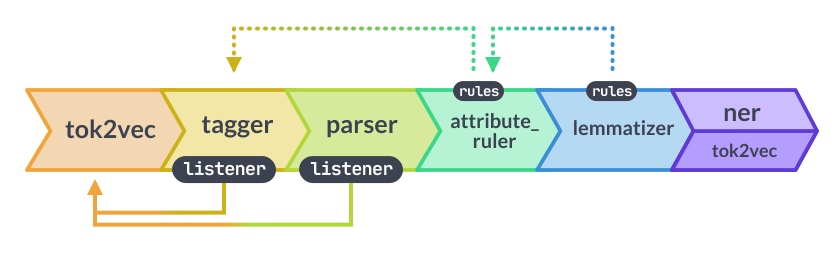

# Setting up Spacy

- `pip install spacy`

- `python -m spacy info` returns information like spacy version.

## Spacy statistical models

- `lang_type_genre_size` - is how the spacy statistical models are named.

- lang - Language
- type - type represenst the model's capabilities. **core** - general purpose model
- genre - Type of the text on which the model was trained. **web** - using resources from the internet.
- size - Size of the model. `sm` - small, `md` - medium, `lg` - large

- `python -m spacy download <model_name>` can be used to download the required statistical model.
- `python -m spacy download en` by default downloads `en_core_web_sm` model.

Models download documentation can be found [here](https://spacy.io/models/en)

## Processing pipeline



## Customizing pipeline

We can disable few stages in the pipeline.

```Python
spacy.load("en_core_web_md", disable=["tagger", "attribute_ruler", "lemmatizer"])
```

---

## References

- [Spacy visualizers](https://spacy.io/usage/visualizers)
- [Spacy pipeline design and customization](https://spacy.io/models#design)
